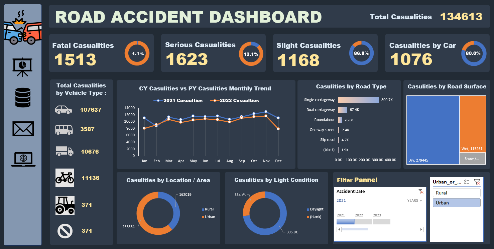

# 🚧 Road Accident Dashboard (2021–2022 Analysis)

## 📌 Project Overview
This project presents an interactive Road Accident Dashboard analyzing accident data from 2021 and 2022. The goal is to uncover patterns, trends, and key insights related to road accidents to support data-driven decision-making.

---

## 📊 Dataset Description
The dataset includes detailed information on road accidents, such as:

- Accident severity (Fatal, Serious, Slight)  
- Vehicle type involved  
- Road type and surface conditions  
- Area (Urban / Rural)  
- Time (Day / Night)  
- Monthly accident records  

---

## 🎯 Key Performance Indicators (KPIs)

### 🔴 Primary KPIs
- Total number of casualties after accidents  
- Total casualties segmented by severity (Fatal, Serious, Slight)  
- Percentage contribution of each severity category  
- Maximum casualties by vehicle type  

### 🟡 Secondary KPIs
- Total casualties with respect to vehicle type  
- Monthly trend comparison (Current Year vs Previous Year)  
- Maximum casualties by road type  
- Distribution based on road surface conditions  
- Casualty analysis based on:
  - Area (Urban vs Rural)  
  - Time (Day vs Night)  

---

## ⚙️ Project Process

### 🧹 Data Cleaning
- Removed duplicate records and null values  
- Standardized categorical fields (vehicle type, road type, etc.)  
- Ensured consistent date formats  

### 🔄 Data Transformation
- Created calculated columns for:
  - Year-wise comparison  
  - Severity percentages  
- Grouped data for monthly trend analysis  

### 📈 Data Analysis
- Used Pivot Tables to:
  - Aggregate casualties by categories  
  - Compare year-on-year performance  
- Applied filters for dynamic insights (Urban/Rural, Day/Night)  

### 📊 Dashboard Creation
- Designed an interactive dashboard with:
  - KPI cards  
  - Bar charts, line charts, and donut charts  
  - Slicers for user-driven filtering  

---

## 🖼️ Dashboard Preview


```md

```


---

## 💡 Key Insights

- Majority of casualties fall under the "Slight" category, indicating high accident frequency but lower fatality rate  
- Urban areas contribute significantly more accidents due to higher traffic density  
- Daytime accidents are more frequent than nighttime accidents  
- Certain vehicle types (e.g., cars and two-wheelers) dominate accident involvement  
- Higher casualties are observed on specific road types (e.g., single carriageways)  
- Monthly trends show fluctuations, indicating possible seasonal or behavioral patterns  
- Year-over-year comparison helps evaluate effectiveness of safety measures  

---

## 🧠 Final Conclusion

The dashboard provides a comprehensive view of road accident patterns across multiple dimensions.

Key takeaways:
- Accident frequency is driven more by traffic exposure than extreme conditions  
- Urban traffic management should be a priority  
- Safety measures should target high-risk vehicle categories  
- Infrastructure improvements are needed for high-casualty road types  
- Monthly trends can guide seasonal safety campaigns  

---

## 🛠️ Tools Used
- Microsoft Excel (Data Cleaning, Analysis, Dashboard)  
- Pivot Tables & Charts  
- Slicers for interactivity
